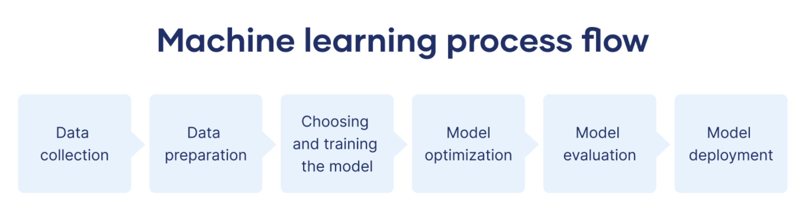

# Credit_Risk_Classification
 About Credit risk poses a classification problem that’s inherently imbalanced. Using a dataset of historical lending activity from a peer-to-peer lending services company, build a model that can identify the creditworthiness of borrowers.

## Overview of the Analysis

The purpose of this analysis is to build a predictive model for assessing the credit risk associated with loan applications. The objective is to enhance the accuracy of identifying high-risk loans (Class 1) while maintaining a high precision for healthy loans (Class 0). By achieving a well-balanced model, financial institutions can make more informed lending decisions, minimizing the risk of default and optimizing their loan approval process.

### Financial Information 

The dataset contains financial information related to loan applicants, including features such as credit score, income, debt-to-income ratio, and other relevant factors. The target variable is a binary label indicating whether a loan is considered high-risk (1) or healthy (0).

### Target Variable

The provided value_counts indicates the distribution of the target variable 'loan_status' in the dataset:
high-risk appicants is   75036 and low-risk applicants is 2500

### Stages of Machine Learning Process 

Split the data into features(X) and labels(y).

Split the Data into Training and Testing Sets

Create a logistic regression model with the original data amd resampled data.

Predict a logistic regression model  with orignal and resampled training Data.

Evaluate the model’s performance by accuracy score, confusion matrix and classification report for both the orignal and resampled data.

Observation analysis from the evaluation reports.

### Method Used

These methods collectively address the challenge of imbalanced data by employing resampling techniques and leveraging logistic regression models. 

Resampling ensures a more equitable representation of both classes during model training, leading to more balanced predictions and potentially improving the model's ability to identify high-risk loans. 

The choice of logistic regression as the modeling algorithm provides a balance between interpretability and predictive power.

## Results

### Machine Learning Model 1:

#### Description of Model 1 Accuracy, Precision, and Recall Scores

Accuracy:  The model classifies the data points upto 95% corrected as the balanced accuracy is 0.99

Precision: Class 1 (High-Risk Loan) has a slightly lower precision ie. 85%, indicating a small proportion of false positives.

Recall Score: An average--the model had 99% recall in predicting low-risk loans, but 91% recall in predicting high-risk loans.

### Machine Learning Model 2:

#### Description of Model 2 Accuracy, Precision, and Recall Scores

Accuracy:  The model classifies the resampled data points corrected with accuracy of 99% for both the high risk and low risk.

Precision: Preceision is same for both the high and low risk i.e. 99%

Recall Score: Prediciting the values through recall is 99%.

High accuracy and high recall for the risky loan applicants further supports the overall robustness of the model.

## Summary

### Recommendation

Machine Learning Model 2, trained with resampled data, outperforms Model 1, particularly in predicting high-risk loans.

Model 2 shows higher precision and recall for high-risk loans, indicating improved effectiveness in identifying potential risks.

### Performance

Although, accuracy of model 1 is high, but  the recall for risky loan applicants is not high enough ,as it should be comapred to the recall for low-risk applicants.

Model 2 provides high accuracy and high recall for the risky loan applicants further supports the overall robustness of the model.

### Considerations

We business domain is also depends on the cosideration ,as banks have senisitive concern with large volume of funds, so the model should be more accruate for high risk applicants. So, we shoud prefer high accuracy and high recall.

## Author

## [Maira Syed GitHub]

 
